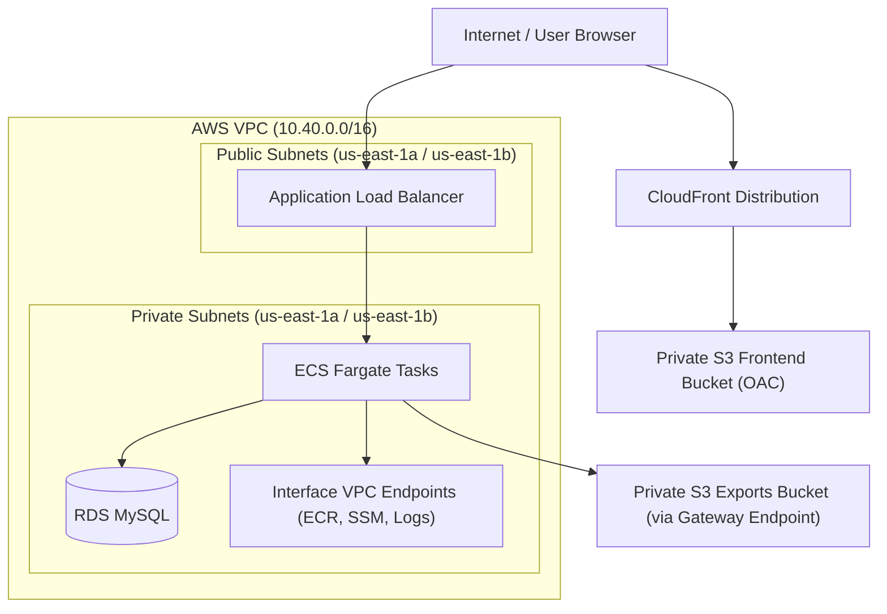

# Network & Systems Architecture

This document details the network topology, systems interaction, and architectural trade-offs chosen for the Smoke Tracker Cloud Dashboard.

---

## 1. Network Topology & Subnet Design

The application is deployed inside a dedicated Virtual Private Cloud (VPC) spanned across two Availability Zones (AZs) to ensure high availability and prevent single-point-of-failure failures.

### 🛰️ Subnet Segregation

1. **Public Subnets (`10.40.1.0/24`, `10.40.2.0/24`)**:
   - Contains the **Application Load Balancer (ALB)**.
   - Associated with an Internet Gateway to route external user requests into the system.
2. **Private Subnets (`10.40.11.0/24`, `10.40.12.0/24`)**:
   - Contains the **ECS Fargate Tasks** and the **RDS MySQL Database**.
   - No direct route to the Internet Gateway. Access to the public internet is disabled by default to minimize the attack surface.

---

## 2. Ingress & Egress Security Boundaries

Traffic flow inside the VPC is strictly controlled via stateful AWS Security Groups configured under a **least-privilege model**:

| Security Group               | Direction | Allowed Target / Source      | Port / Protocol | Rationale                                                                |
| :--------------------------- | :-------- | :--------------------------- | :-------------- | :----------------------------------------------------------------------- |
| **ALB SG** (`alb`)           | Ingress   | `0.0.0.0/0`                  | `80/TCP` (HTTP) | Accept public traffic from browsers (redirected to HTTPS by CloudFront). |
|                              | Egress    | ECS Task SG (`service`)      | `4000/TCP`      | Forward traffic only to active backend containers.                       |
| **ECS Task SG** (`service`)  | Ingress   | ALB SG (`alb`)               | `4000/TCP`      | Only allow requests routed through the Load Balancer.                    |
|                              | Egress    | RDS Database SG (`database`) | `3306/TCP`      | Connect to MySQL for data persistence.                                   |
|                              | Egress    | Endpoint SG (`endpoint`)     | `443/TCP`       | Access interface VPC endpoints privately.                                |
|                              | Egress    | S3 Prefix List               | `443/TCP`       | Access S3 exports and ECR image layers privately.                        |
| **RDS DB SG** (`database`)   | Ingress   | ECS Task SG (`service`)      | `3306/TCP`      | Accept queries only from active container tasks.                         |
| **Endpoint SG** (`endpoint`) | Ingress   | ECS Task SG (`service`)      | `443/TCP`       | Accept private HTTPS API calls from tasks.                               |

---

## 3. The Egress Model: VPC Endpoints vs. NAT Gateway

In standard cloud designs, private subnets require a **NAT Gateway** to allow resources to pull packages, write logs, or download secrets. However, a NAT Gateway has a high fixed hourly cost (~$32/month) and exposes the VPC to outbound internet access.

This project implements an **Endpoints-Only Egress Model**:

- **Interface VPC Endpoints (PrivateLink)**: Provisioned for `ecr.api`, `ecr.dkr`, `secretsmanager`, and `logs`. They place private Network Interfaces (ENIs) inside the private subnets.
- **Gateway VPC Endpoint**: Provisioned for `s3`. It injects a routing rule directly into the private route table (`pl-xxxx -> vpce-xxxx`), directing S3 traffic directly to the S3 backbone for **free**.
- **Result**: ECS tasks can securely pull Docker images, write logs to CloudWatch, query Secrets Manager, and upload file exports to S3 without a NAT Gateway or any path to the public internet.

---

## 4. Systems Request Flow

1. **Static Assets**: The user requests the dashboard UI. The request is resolved by **CloudFront**, which serves static React assets cached from the private **S3 Frontend Bucket** using **Origin Access Control (OAC)**.
2. **API Requests**: The React app makes calls to `/v1/*`. CloudFront routes these requests to the public **ALB**.
3. **Task Forwarding**: The ALB forwards the traffic internally to the **ECS Fargate Tasks** in the private subnets.
4. **Configuration**: At boot, the ECS container agent fetches credentials from **AWS Secrets Manager** and pulls the image from **ECR** using the VPC endpoints.
5. **Database Interaction**: The Fastify API performs CRUD operations against the private **RDS MySQL** database.
6. **Data Exports**: The backend generates CSV/JSON data, uploads it to the private **S3 Exports Bucket** (via S3 Gateway Endpoint), and returns a short-lived **S3 Presigned URL** to the browser.
