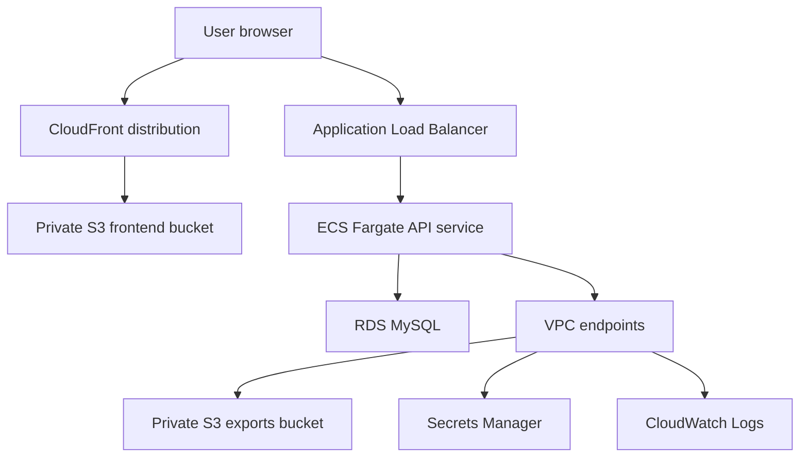

# Architecture

## Runtime Flow

## Request Flow

1. The React app is built as static assets and uploaded to S3.
2. CloudFront serves the static frontend through Origin Access Control.
3. The frontend calls the API through the Application Load Balancer.
4. ECS Fargate runs the Fastify container in private subnets with no public IP.
5. The API stores relational product data in RDS MySQL.
6. VPC endpoints provide private access to ECR, S3, Secrets Manager, and CloudWatch Logs.

## Security Boundaries

- The frontend bucket blocks public access and is only reachable through CloudFront.
- ECS tasks run in private subnets and do not receive public IP addresses.
- Private subnets do not have a default route to an internet gateway or NAT gateway.
- AWS service access from ECS uses VPC endpoints for ECR, S3, Secrets Manager, and CloudWatch Logs.
- RDS is in private subnets and accepts MySQL traffic only from ECS tasks.
- ECS task execution uses IAM roles instead of static AWS keys.
- GitHub Actions should use AWS OIDC and a least-privilege deployment role.

## Cost-Control Notes

The dev environment avoids NAT Gateway cost while keeping ECS tasks private. Interface VPC endpoints add hourly cost, but they provide the AWS service paths the task needs without giving it general outbound internet access.
