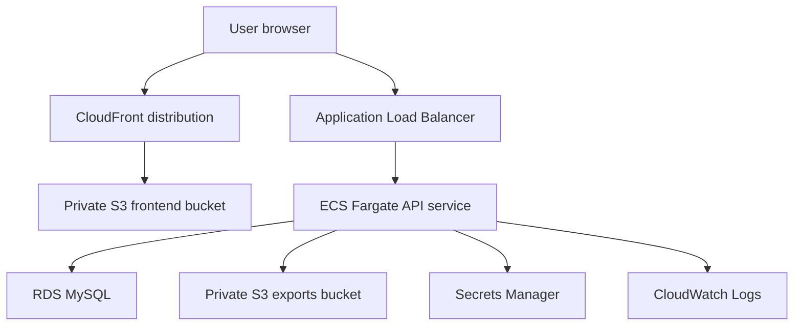

# Architecture

## Runtime Flow

## Request Flow

1. The React app is built as static assets and uploaded to S3.
2. CloudFront serves the static frontend through Origin Access Control.
3. The frontend calls the API through the Application Load Balancer.
4. ECS Fargate runs the Fastify container and writes structured logs to CloudWatch.
5. The API stores relational product data in RDS MySQL.
6. Secrets Manager provides runtime database and JWT secrets.

## Security Boundaries

- The frontend bucket blocks public access and is only reachable through CloudFront.
- RDS is in private subnets and accepts MySQL traffic only from ECS tasks.
- ECS task execution uses IAM roles instead of static AWS keys.
- GitHub Actions should use AWS OIDC and a least-privilege deployment role.

## Cost-Control Notes

The dev environment intentionally keeps the networking simple and avoids a NAT Gateway by running the Fargate task with a public IP behind the ALB. A stricter production design can move tasks into private subnets with VPC endpoints or NAT, but that increases cost and operational complexity.
