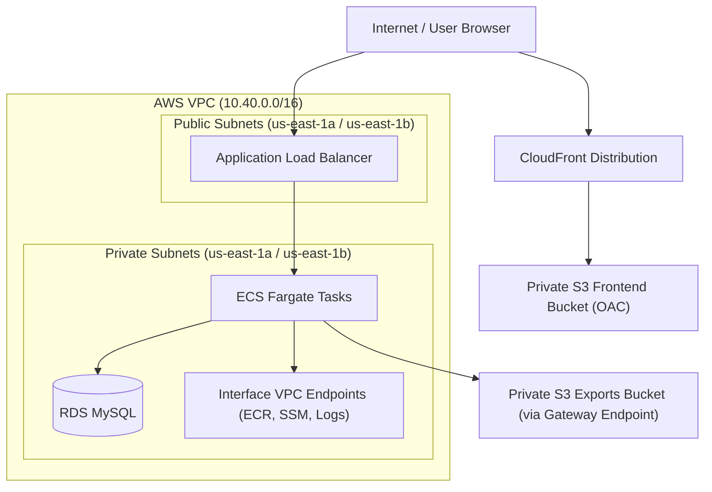
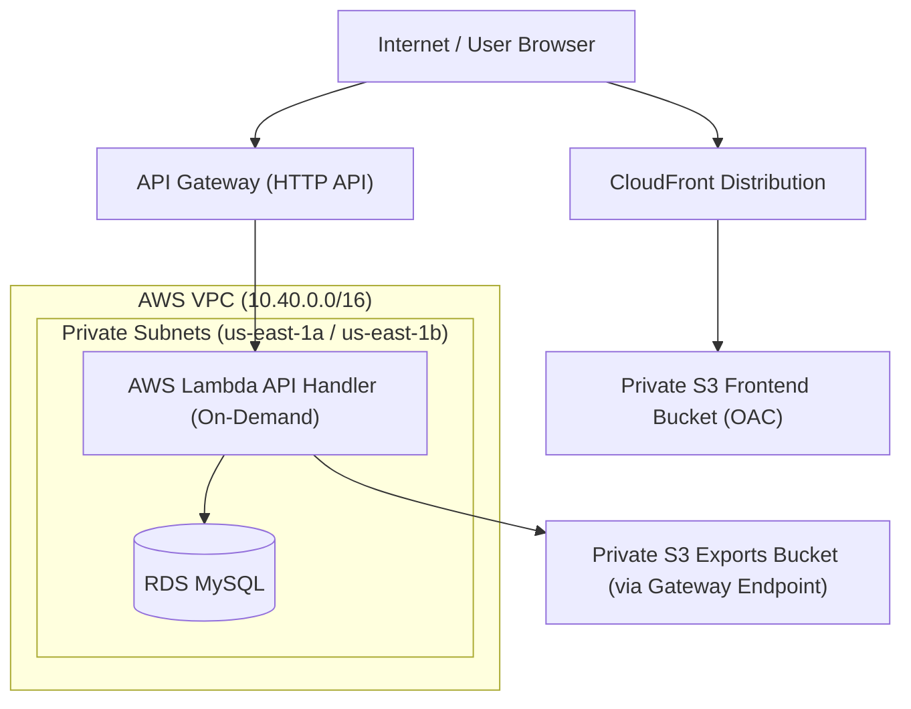

# Network & Systems Architecture

This document details the network topology, systems interaction, and architectural trade-offs chosen for the Smoke Tracker Cloud Dashboard.

---

## 1. Network Topology & Subnet Design

The application supports three distinct environment topologies to balance availability, security, and cost:

1. **`production-reference` (Enterprise-Grade ECS)**: ECS tasks run in private subnets with no public IP. The tasks access ECR, Secrets Manager, and CloudWatch privately via Interface VPC endpoints.
2. **`live-demo` (Cost-Optimized ECS)**: ECS tasks run on Fargate Spot in public subnets with public IPs. Egress goes directly to the internet (free), bypassing VPC interface endpoints to save ~$86/month.
3. **`serverless-demo` (Ultimate Serverless Low-Cost)**: Backend Fastify API runs on AWS Lambda and API Gateway (HTTP API) instead of ECS and ALB. Compute and API routing scale to zero when not in use.

### 📐 ECS Topology Diagram (live-demo / production-reference)

### 📐 Serverless Topology Diagram (serverless-demo)

### 🛰️ Subnet Segregation

1. **Public Subnets (`10.40.1.0/24`, `10.40.2.0/24`)**:
   - Contains the **Application Load Balancer (ALB)** (in ECS topologies).
   - Associated with an Internet Gateway to route external user requests into the system.
2. **Private Subnets (`10.40.11.0/24`, `10.40.12.0/24`)**:
   - Contains the **ECS Fargate Tasks** (or **AWS Lambda Functions** in the serverless topology) and the **RDS MySQL Database**.
   - No direct route to the Internet Gateway. Access to the public internet is disabled by default to minimize the attack surface.

---

## 2. Ingress & Egress Security Boundaries

Traffic flow inside the VPC is strictly controlled via stateful AWS Security Groups configured under a **least-privilege model**:

| Security Group               | Direction | Allowed Target / Source      | Port / Protocol | Rationale                                                                |
| :--------------------------- | :-------- | :--------------------------- | :-------------- | :----------------------------------------------------------------------- |
| **ALB SG** (`alb`)           | Ingress   | `0.0.0.0/0`                  | `80/TCP` (HTTP) | Accept public traffic from browsers (redirected to HTTPS by CloudFront). |
|                              | Egress    | ECS Task SG (`service`)      | `4000/TCP`      | Forward traffic only to active backend containers.                       |
| **ECS Task SG** (`service`)  | Ingress   | ALB SG (`alb`)               | `4000/TCP`      | Only allow requests routed through the Load Balancer.                    |
|                              | Egress    | RDS Database SG (`database`) | `3306/TCP`      | Connect to MySQL for data persistence.                                   |
|                              | Egress    | Endpoint SG (`endpoint`)     | `443/TCP`       | Access interface VPC endpoints privately.                                |
|                              | Egress    | S3 Prefix List               | `443/TCP`       | Access S3 exports and ECR image layers privately.                        |
| **RDS DB SG** (`database`)   | Ingress   | ECS Task SG (`service`)      | `3306/TCP`      | Accept queries only from active container tasks.                         |
| **Endpoint SG** (`endpoint`) | Ingress   | ECS Task SG (`service`)      | `443/TCP`       | Accept private HTTPS API calls from tasks.                               |

---

## 3. The Egress Model: VPC Endpoints vs. NAT Gateway

In standard cloud designs, private subnets require a **NAT Gateway** to allow resources to pull packages, write logs, or download secrets. However, a NAT Gateway has a high fixed hourly cost (~$32/month) and exposes the VPC to outbound internet access.

This project implements two distinct egress models depending on the topology:

- **Interface VPC Endpoints (PrivateLink)**: In `production-reference`, these are provisioned for `ecr.api`, `ecr.dkr`, `secretsmanager`, and `logs` to place private ENIs in the private subnets.
- **Gateway VPC Endpoint**: Provisioned for `s3` across all topologies. It injects a routing rule directly into the private route table (`pl-xxxx -> vpce-xxxx`), directing S3 traffic directly to the S3 backbone for **free**.
- **Deploy-time Secrets (Serverless-specific)**: In the `serverless-demo` environment, ECR pulls are handled at creation time by AWS, and secrets are resolved from Secrets Manager at deploy-time by Terraform and injected directly as environment variables. This avoids ECR, Secrets Manager, and Logs Interface VPC Endpoints entirely, bringing VPC endpoints compute idle costs to **$0.00**.
- **Internet Gateway Egress (live-demo-specific)**: Fargate Spot tasks run in public subnets and route egress traffic directly through the IGW, avoiding endpoint costs at the expense of needing public IPs.

---

## 4. Systems Request Flow

1. **Static Assets**: The user requests the dashboard UI. The request is resolved by **CloudFront**, which serves static React assets cached from the private **S3 Frontend Bucket** using **Origin Access Control (OAC)**.
2. **API Requests**: The React app makes calls to `/v1/*`. CloudFront routes these requests to the backend API origin:
   - In ECS topologies: Routes to the public **ALB**.
   - In serverless topology: Routes to the **API Gateway (HTTP API)**.
3. **API Processing**:
   - In ECS topologies: The ALB forwards traffic to the **ECS Fargate Tasks** in the private subnets.
   - In serverless topology: The API Gateway triggers the **AWS Lambda API Handler** inside the private subnets.
4. **Configuration**:
   - ECS containers fetch runtime secrets from Secrets Manager over VPC endpoints or the internet.
   - Lambda functions read pre-injected environment variables.
5. **Database Interaction**: The Fastify API performs CRUD operations against the private **RDS MySQL** database.
6. **Data Exports**: The backend generates CSV/JSON data, uploads it to the private **S3 Exports Bucket** (via S3 Gateway Endpoint), and returns a short-lived **S3 Presigned URL** to the browser.
