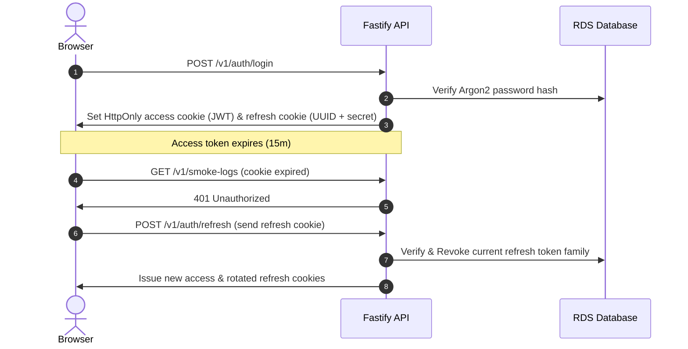

# SaaS Security & Identity Access Management

This document details the security posture, multi-tenant isolation mechanics, and authentication architecture implemented in the Smoke Tracker Cloud Dashboard.

---

## 1. Multi-Tenant Logical Isolation

To prevent cross-tenant data leaks (a critical concern in SaaS platforms), data access is isolated at the application query level:

- **User Context Scoping**: Every database transaction that accesses or modifies data (smoke logs, items, goals, or exports) is scoped strictly to the authenticated user ID:
  ```typescript
  // Example of strict query-level isolation
  prisma.smokeLog.findMany({
    where: { userId: request.currentUser.id },
  });
  ```
- **UUID Primary Keys**: Database schemas utilize UUID v4 identifiers instead of auto-incrementing integers. This prevents enumeration attacks (e.g., guessing `/v1/smoke-logs/12`) and secures data boundaries.

---

## 2. Authentication & Session Lifecycles

The application implements a stateless-to-stateful hybrid session model designed for high security:



### 🔐 Refresh Token Rotation (RTR)

To mitigate cookie theft and unauthorized session hijackings:

1. **One-Time Use**: Refresh tokens are single-use credentials. When used to obtain a new short-lived access token, the current refresh token is immediately marked as `revoked`.
2. **Token Rotation**: A new, unique refresh token is generated and returned to the client inside the same cycle.
3. **Replay Attack Detection (Token Family Revocation)**: If a revoked refresh token is presented to the `/refresh` endpoint, the API assumes a replay attack is occurring (e.g., an attacker stole a cached cookie). The API immediately **revokes the entire token family** (all active refresh tokens for that user ID), force-invalidating all active sessions for that user.
4. **Secure Cookie Constraints**: Both access and refresh tokens are delivered via cookies configured with `HttpOnly` (blocking XSS script access), `Secure` (enforcing SSL/TLS transit), and `SameSite=Lax` (preventing CSRF).

---

## 3. Infrastructure & IAM Segregation

The project adheres to the principle of least privilege using granular AWS IAM roles:

1. **ECS Task Execution Role**: Used by the AWS ECS Agent during container startup.
   - **Scope**: Granted `ecr:GetDownloadUrlForLayer`, `ecr:BatchGetImage` to pull container images, and `secretsmanager:GetSecretValue` to fetch the database string and JWT tokens.
2. **ECS Task Role**: Used by the Node.js process itself at runtime.
   - **Scope**: Granted `s3:PutObject` and `s3:GetObject` restricted strictly to the exports bucket path (`arn:aws:s3:::smoke-tracker-cloud-dashboard-exports/exports/*`). It has no execution-level access to ECR or Secrets Manager.
3. **CloudFront OAC (Origin Access Control)**: Restricts S3 frontend bucket access. Public access is disabled on S3, and only CloudFront signed service principals can retrieve static assets.
